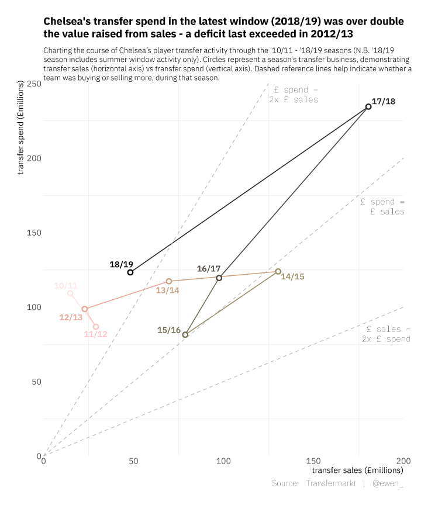
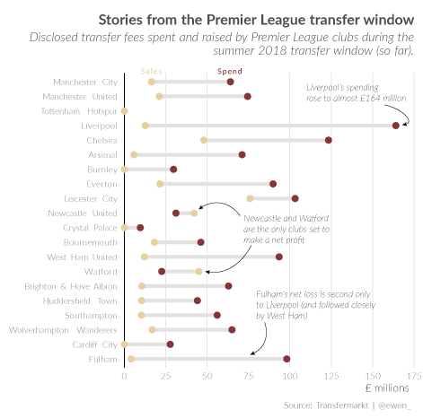

transfers
================

Data on European football clubs' player transfers, through 1992/93 to 2019/20 seasons (as found on [Transfermarkt](https://www.transfermarkt.co.uk/)).

Data
----

Transfers can be found in the `data` directory, in .csv format. There's a sub-directory for each year/season (e.g. 2018/19 season is in `data/2018`) containing data for each of these leagues:

- English Premier League
- English Championship
- French Ligue 1
- German 1.Bundesliga
- Italian Serie A
- Spanish La Liga 
- Portugese Liga NOS
- Dutch Eredivisie
- Russian Premier Liga

Common variables:

-   `club_name` (club)
-   `player_name` (player name
-   `age` (player age at time of scrape)
-   `position` (player position)
-   `club_involved_name` (other club involved in transfer)
-   `fee` (raw transfer fee information)
-   `transfer_movement` (transfer in/out)
-   `fee_cleaned` (numeric `fee`, GBP)
-   `league_name` (league)
-   `year` (year)
-   `season` (season, interpolated from `year`)

Code
----

All source code found in `/src`.

Usage
-----

Sources
-------

All squad data was scraped from [Transfermarkt](https://www.transfermarkt.co.uk/), in accordance with their [terms of use](https://www.transfermarkt.co.uk/intern/anb).
